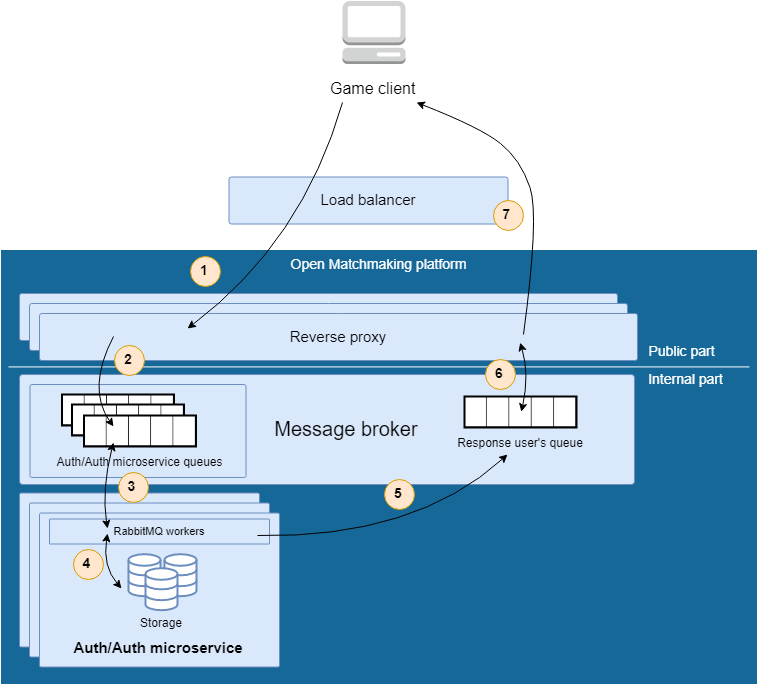
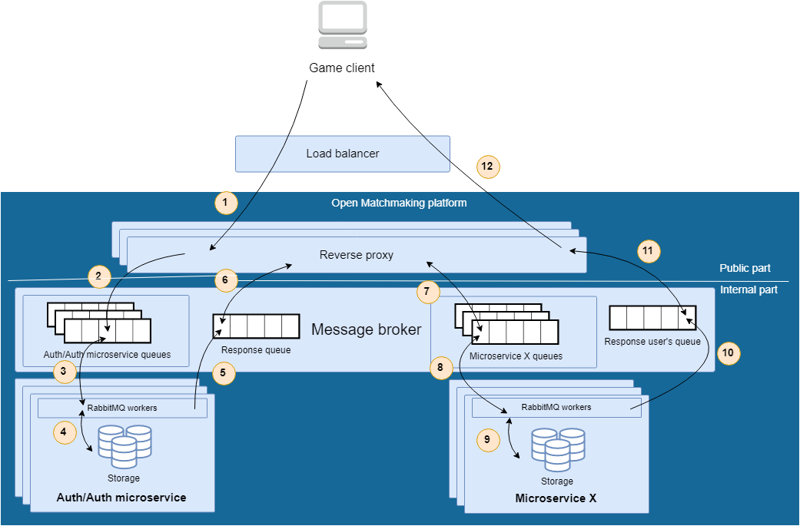

# Architecture

Summary
-------
- [**How it works**](architecture.md#how-it-works)
- [**Protocol**](protocol.md)

How it works
------------
Before you will dive into details, let's mention components, which are used during the architecture consideration:
1. **Game client**. Represents a certain "unified shell" for each active user, which is connected to the main game server and exchanges data with it if necessary.
2. **Game server**. Represents an existing node in a cluster, which transmits data about its internal state of the particular game and allow its connected clients to maintain their own accurate version of the game world for display to players. Also could processing/receiving each player's input, messages and so on.
3. **Open Matchmaking platform**. That is the core component of our platform, to what we are aiming for. It do everything that related to the matchmaking and that is expected from this service: 
    - Searching an opponent with similar skills (or a suitable team, if it is a competitive game that focus on the teamplay) for each player, so that the chances will be close to the 50/50 percents of win/lose. And it is bringing a lot of opportunites to improve its skills and fun for everyone in each match.
    - Providing a lot different strategies (or matchmaking algorightms), that could be used for different game modes and genres at the same time.
    - Collecting some statistics, that could be used for further data processing, like creating the leaderboards, plays of the day and etcetera after ending each match.

Now let's move on to the usage of the Open Matchmaking platform for your own game. Before getting any access to matchmaking services we should be authorized in the system and after send requests for a processing. In general, it's a good solution for us, because:
- In cloud components actively uses Authentication / Authorization layer. And Open Matchmaking platform should not be an exception.
- The project can have a private cloud, but you can't get an access to add some external dependencies and necessary somehow provide a way to connect players together.
- Necessary to divide the project on the small parts, which can be developed by different developers and studios (like sharing of responsibility), but you need also a Authentication / Authorization layer.

User authentication / authorization 
-----------------------------------
Before getting an access to the certain microservice, user has to be registered and received the token that must be provided in request body. The representation of those communications with microservice is shown on the following picture:

  

1. Client sends request to the Auth/Auth microservice and provides some required data (login/password, etc.). The request is forwarded by load balancer (it could be any Open Source solution or provided by a cloud provider) to reverse proxy node. 
2. The reverse proxy node passes the received request into Auth/Auth microservice queues which are listened by RabbitMQ workers that are going to do some useful work. In addition to it, the reverse proxy node creates the special queue for the responses that will be returned to enduser later.
3. One of RabbitMQ workers receives the user's request and starting to process it. During the processing, works does the following work:  
  3.1. Checks the credentials for a user. If they aren invalid - returns an error, otherwise going further.
  3.2. Generating a new token for the client.  
  3.3. Prepare the response for a client return access token.
4. The prepared token is saved in databases for speed up the check process when it's necessary.
5. The RabbitMQ workers, based on the work from 3-4 steps pushes the prepared response to the "Response user's queue" which is listening by reverse proxy and waiting for a message.
6. Reverse proxy application takes the response and converts it appropriate format, described in [protocol documentation](protocol.md).
7. The prepared response returns to enduser.

Forwarding requests to microservices
-------------------------------------
For the case when necessary to communicate with the certain microservice, the internal communications are quite similar to those was described in the previous part. Schematically those communications could look like this:

  

1. Client sends request to the Auth/Auth microservice and provides some required data (login/password, etc.). The request is forwarded by load balancer (it could be any Open Source solution or provided by a cloud provider) to reverse proxy node. 
2. The reverse proxy node passes the received request into Auth/Auth microservice queues which are listened by RabbitMQ workers that are going to do some useful work. In addition to it, the reverse proxy node creates the special queue for the responses that will be returned to enduser later.
3. One of RabbitMQ workers receives the user's request and starting to process it. 
4. During the request processing, the RabbitMQ worker communicates with databases and checks the passed credentials for a user. If they are invalid - returns an error.
5. The RabbitMQ workers, based on the work from 3-4 steps pushes the prepared response to the "Response user's queue" which is listening by reverse proxy and waiting for a message.
6. Based on the received response, reverse proxy passes the actual request to the certain request in the case if everything is correct and has no errors. Otherwise, the client will receive an error message.
7. The reverse proxy passes actual request into the certain queue, that listening by microservice.
8. One of RabbitMQ workers takes the request and start processing in according with their business logic.
9. During the request processing stage, worker can communicate with different storages (databases, caches, etc.) for reading/writing data and serializing it.
10. The prepared response is pushed by the worker into response queue, listened by reverse proxy.
11. Reverse proxy application takes the response and converts it appropriate format, described in [protocol documentation](protocol.md).
12. The prepared response returns to enduser.
